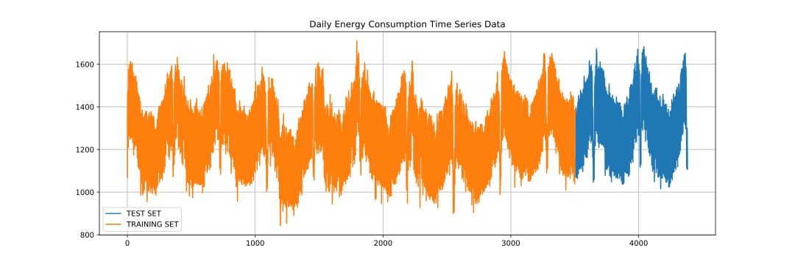

# Energy-Consumption-Time-Series-Prediction-


The data set: Open Power Systems Data
In this project, we’ll be working with daily time series of Open Power System Data (OPSD) for Germany, which has been rapidly expanding its renewable energy production in recent years. The data set includes country-wide totals of electricity consumption, wind power production, and solar power production for 2006-2017.

Electricity production and consumption are reported as daily totals in gigawatt-hours (GWh). The columns of the data file are:
- Date — The date (yyyy-mm-dd format)
- Consumption — Electricity consumption in GWh
- Wind — Wind power production in GWh
- Solar — Solar power production in GWh
- Wind+Solar — Sum of wind and solar power production in GWh

## Requirements
- Pickle 4.0
- Panda 0.23.3
- Matplotlib 2.2.2

## Reading and Displaying Daily Energy Consumption Time Series Data
Let’s import the required library:

```
import pickle
import matplotlib.pyplot as plt
import pandas as pd
from pandas import datetime
```

load the daily time series of Open Power System Data (OPSD) for Germany:
```
def parser(x):
    return datetime.strptime('' + x, '%Y-%m-%d')
opsd_daily = pd.read_csv('opsd_germany_daily.csv',parse_dates=[0], date_parser=parser)
print(opsd_daily.head(3))
print(opsd_daily.shape) # shape of (4383, 5)
```
        Date  Consumption  Wind  Solar  Wind+Solar
      0 2006-01-01     1069.184   NaN    NaN         NaN
      1 2006-01-02     1380.521   NaN    NaN         NaN
      2 2006-01-03     1442.533   NaN    NaN         NaN
      (4383, 5)

Prepare the daily consumption data:
```
opsd_daily_Consumption = pd.DataFrame(data=opsd_daily['Consumption'], index=opsd_daily.index)
```

At this step, the variable "opsd_daily_Consumption" is a pandas DataFrame of a daily energy consumption with shape of (4383, 1)

### Splitting Data for Training and Testing
We will split our data such that
- Train: 80%, Test: 20%
```
train_size = int(len(opsd_daily_Consumption) * 0.8)
test_size = len(opsd_daily_Consumption) - train_size
train_opsd_daily_Consumption, test_opsd_daily_Consumption = opsd_daily_Consumption[0:train_size], opsd_daily_Consumption[train_size:len(opsd_daily_Consumption)]
```

Plot the Splitting Data code
```
_ = test_opsd_daily_Consumption.rename(columns={'Consumption': 'TEST SET'}) \
    .join(train_opsd_daily_Consumption.rename(columns={'Consumption': 'TRAINING SET'}), how='outer') \
    .plot(figsize=(15,5), title='Overall Charge')
plt.grid()
plt.show()
```
Running the code gives the following plot that show the Training and Testing curve


### Save the data into pickle file
```
with open('Train-Test_opsd_daily_Consumption.pkl', 'wb') as f:
    pickle.dump([train_opsd_daily_Consumption, test_opsd_daily_Consumption], f)
```

### Re-load the variables on the Pickle file
```
train_opsd_daily_Consumption, test_opsd_daily_Consumption = pickle.load(open('Train-Test_opsd_daily_Consumption.pkl', "rb"))
```
